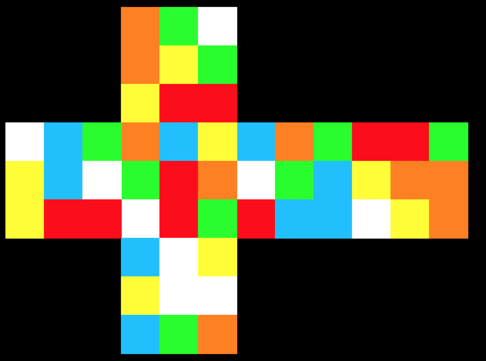
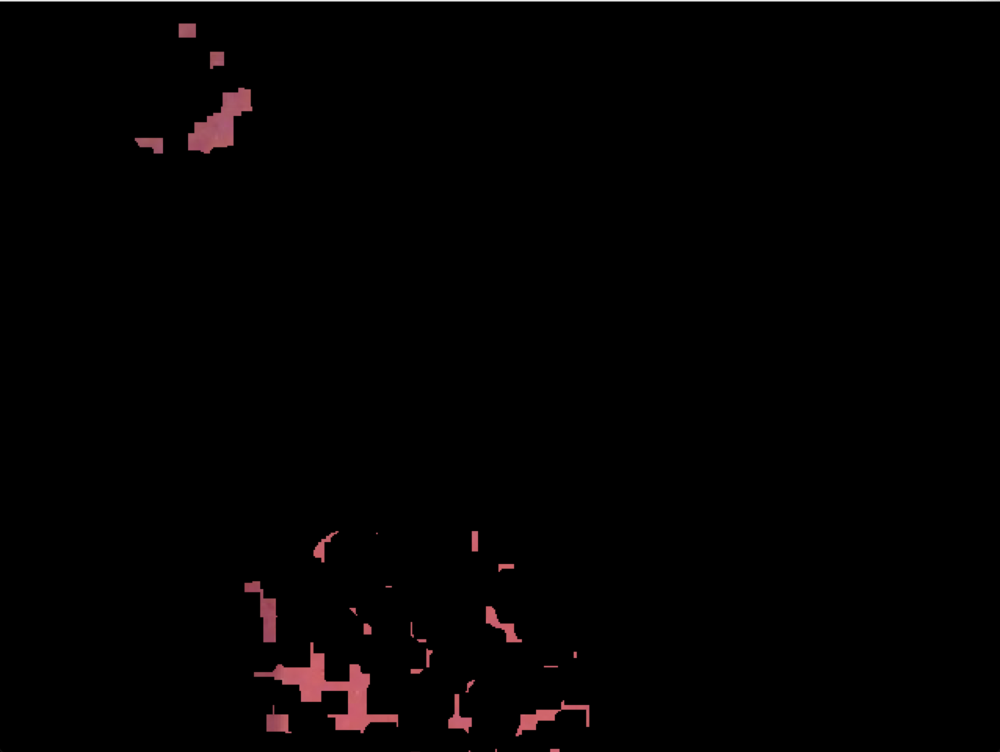

# Fichier colordraw.py

Ce fichier a une fonction frawcolor, cette fonction est utilisé pour afficher les 6 faces, assuer que les colors sont justes et dans les cases corrects.

# Fichier colordetect.py

Ce fichier a deux fonctions : colorMatch et midpoint(sous-fonction),et une fonction main pour exécuter.

Pour la fonction colorMatch, c'est la fonction importante pour traiter les images. Elle traite des colors et returne une String:

Resultat : les colors:B R D B U R U F F L B R D R L F L L B L U R F B D F R L D U U D D L R B D L R U L D U F F F F R U B B D U B .

Pour la fonction main, j'utilse le module multiprocessing et la class pool pour traiter les 6 faces en même temps. ca va gagner beaucoup de temps.

Pour le tester, exécuter python colordetect.py. les 2 fichiers python sont operationnels.

## Test avec le robot

après la première test avec le robot, Les photos sont floues et ne peuvent pas être traitées avec succès.

Dans __le répertoire Comparaison__, nous pouvons traiter avec succès la image up.jpg (exemple):

__les colors de up:O G W O Y G Y R R__ 

Mais nous ne pouvons pas traiter la image jaune.jpg (robot):

__TypeError: 'NoneType' object is not subscriptable__

Parce que la image jaune.jpg est floue, Le programme ne traite pas la couleur avec précision.

Dans __le répertoire c__, j'ai essayé d'obtenir les couleurs rouge et orange de la photo et de les afficher, mais les résultats ont été infructueux.

​														(red)

​														(orange)